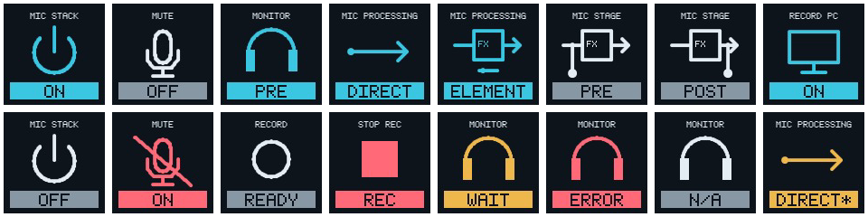
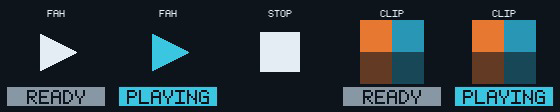
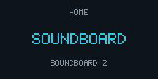
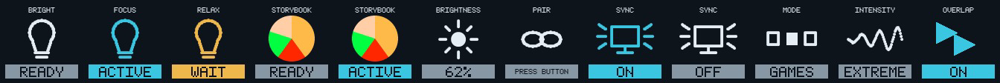
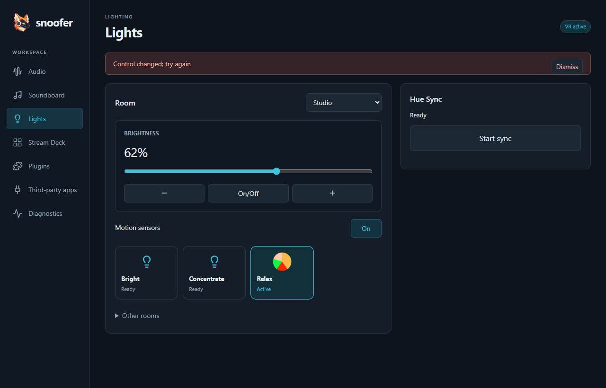
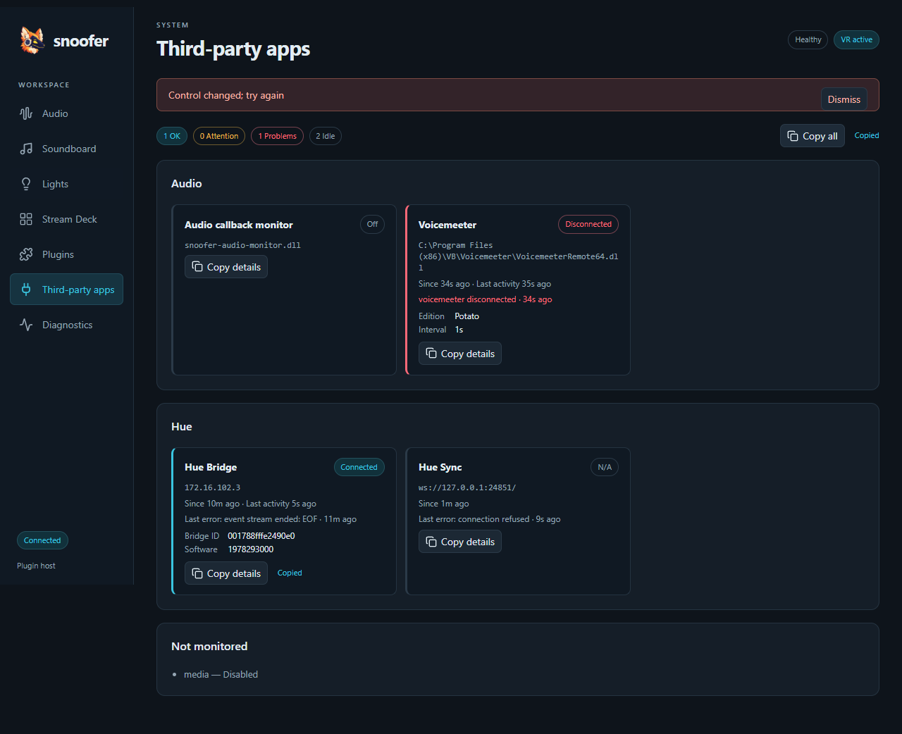

# UI contract

This is the baseline for every build, not a redesign prompt. Change it only when a requested UX change requires it. Preserve everything outside that change.

## Branding
Use the existing Snoofer mascot from app/tray.ico (source artwork in docs/assets). Do not invent a replacement logo or monogram for a new surface. Preserve the existing centered painterly mascot at the top of README.md when rewriting documentation.

## Goals and tone
Fast recognition, truthful state, predictable actions. Users know Snoofer. Use short nouns and state words, sentence case in source, no tutorial copy, enthusiasm, redundant qualifiers or implementation terminology. Keep consequential warnings (restart/recording interruption) and actionable error details.

## Content by surface
| Surface | Content |
| --- | --- |
| Deck key | Short label, recognizable icon, current state or local status. One or two words where possible; max 16 ASCII characters for built-ins. No explanatory sentences, action IDs or profile suffix on active-profile controls. |
| Deck dial | Target, gain, live meter; page dial shows previous/current/next page names on three lines, with the current name larger and cyan; neighboring names are smaller and neutral. Press still returns Home. No repeated gain label when dB is visible. |
| GUI | Task-oriented Audio, Soundboard, Lights, Stream Deck, Plugins, Third-party apps and Diagnostics screens. Plugins only enables, disables and retries; no settings or plugin controls appear there. Native controls, keyboard focus, spatial deck editor and persistent local feedback. |
| Tray | Open controls, lifecycle actions, concise state. No tutorials. |

Provider Label identifies an action without an icon. Optional ShortLabel is for compact icon-bearing surfaces. Shortening presentation must never change IDs, layout bindings, command semantics or saved settings. Fixed-profile bindings retain Normal/VR qualifiers. Custom plugin labels remain intact.

## Vocabulary
| Meaning | Deck label/state |
| --- | --- |
| Mic mute / speaker mute | Mute (different mic/speaker icons) |
| Monitoring | Monitor; Off / Pre / Post |
| Processing | Mic processing; Direct / Element |
| Stack enablement | Mic stack; On / Off |
| Mic stack Off on the deck | Mic mute, Mic target, Processing, Monitor, Mic gain, Record mic and Mic stage keys/dials are blank and inert (bindings kept); Mic stack stays visible. The GUI keeps showing them. |
| Input selection | Mic target; Auto / selected device |
| Recording capture | Record mic / Record PC; On / Off |
| Recording tap | Mic stage; Pre / Post |
| Recorder transport | Record / Stop rec; Ready / Rec |
| Media transport | Prev / Play / Next / Stop; no fictitious playback state |
| Soundboard | Filename / Stop; Ready / Playing (cyan), Wait during normalization; failures stay local to the clip |
| Gain | Playback / Mic; numeric dB and meter |
| Soundboard gain | Volume; numeric dB; press resets to 0 dB |
| Soundboard overlap | Overlap; On / Off (stacked play symbol). On: up to 8 clips play together, the oldest is cut; Stop silences all |
| Hue scene | Scene name; Ready / Active (cyan); Wait until the bridge confirms |
| Hue room dial | Brightness: percent or Off, press toggles on/off; no color-temperature control |
| Hue pairing | Pair; Ready / Press button / Paired |
| Hue Sync | Sync; On (cyan) / Off. Sync bright: percent, press toggles sync. Mode / Intensity: app value |
| Pending | Wait |
| Unavailable or unknown | N/A; meter LEVEL N/A |
| Failed | Error; detailed diagnostic in GUI |
| Overridden normal profile | VR; GUI VR override |

Status takes priority only on the affected control. Keep uncertainty distinct from Off or zero. Meter expiry must not show silence. Ready is not recording; enabled capture is not recorder transport.

## Color semantics
Colors supplement shape and words; they never carry state alone. Key backgrounds stay dark; no perimeter borders. Icon and state badge follow the same local semantic accent.
| Meaning | Deck color | Use |
| --- | --- | --- |
| Normal text | #E3EDF3 | Labels and neutral symbols |
| Neutral | #8797A3 | Off, Ready, generic commands |
| Active | #3AC6E1 | On/live, active processing mode, enabled monitor |
| Attention | #EEB74C | Wait, fallback, confirmation |
| Critical / audio inhibition | #FF6978 | Error, muted mic/output, recorder currently recording |
| Unavailable | #8797A3 | N/A; never danger merely because a device is absent |
| Background | #0E141B | Key and dial background |
| Meter signal | #2DD28C / #F5BE3C / #FF5A64 | -60..0 dBFS; amber from the -12 dB region, red near -3 dB; not application status |

Precedence: unavailable > failure > pending/fallback > muted/recording > active > neutral. Ordinary Off is neutral, including disabled mic stack. Recording's circle/square and Ready/Rec distinguish transport state. No arbitrary colors per control/category. Color definitions and precedence live in internal/streamdeck/palette.go.

The GUI replaces the terminal renderer. Use the available workspace responsively: a vertical sidebar (Up/Down), content cards, and a spatial deck grid with a contextual inspector. Tab follows standard focus order; arrows on the deck follow its geometry. Never dispatch a binding merely by selecting its position. Keep text edits, search and focus stable during live updates. Surface-only audio transport actions stay off the Audio page; they remain available as deck bindings.

GUI icons are Lucide line icons (vendored; nav, buttons, placeholders, deck previews), never Unicode glyphs; Stream Deck hardware keys keep their code-drawn icons. GUI styling is Tailwind utilities with palette tokens in app/web/tailwind.css; no hand-written component classes. The sidebar has no host-connection footer; a lost host connection appears as the error notice. The shared header shows only transient badges (Sending, VR active); audio health appears as the Engine row on the Audio screen and on Diagnostics, never in the header. Apply the shared state palette to the GUI, with a separate visible focus outline. Normal sections are subdued but editable during VR override. Keep important errors local and visible; Diagnostics holds full details. Explicit Save/Discard applies only to draft deck configuration; regular audio controls remain live. Use the existing logo, not a new mark. Minimum window is 800×600; do not cap the workspace to terminal dimensions.

## Visual and behavioral invariants
- Studio line icons, dark background, label above symbol, state badge below; no key outline.
- Signal path is left-to-right. Direct bypasses FX; Element passes through FX. Pre/Post taps branch before/after FX.
- Mic stack is power, mute is a mic with a slash when muted.
- Keep native rotation, blank unused keys, user-owned pages, dial pagination and meter placement.
- Do not change bindings, page positions, shortcuts, profile ownership, save/apply behavior or confirmations as a side effect of copy/style work.
- A UI change must update this contract when needed, add/update focused presentation checks, and inspect actual native-size renderer output. No fresh visual direction or synonyms on routine builds.

## Visual baseline

Top: normal labels and signal-path states. Bottom: stack Off, muted, recorder Ready/Rec, Wait, Error, N/A, and fallback. The last example shows the amber fallback accent and * suffix. A supplied fallback never relies on color alone.

## Soundboard pages
Opt-in auto_controls prefixes fill unbound keys and add runtime overflow pages. Manual and shared bindings win. File names are labels; Play/Stop symbols identify transport. Matching PNG/JPEG/WebP/GIF artwork fits proportionally within a square and may replace the clip symbol in a 64px area, preserving its filename and state badge. Artwork colors are user content; badges retain semantic colors. GIF artwork uses its first frame as a static icon. Invalid/missing artwork falls back to Play. Stop remains at the configured position on every generated page. The configurator edits the saved template and previews automatic bindings; clearing the prefix disables automatic filling.

Soundboard key reference (Ready, Playing, Stop, and sample artwork in Ready/Playing):

Page dial reference:

## Hue
Scene keys show generated artwork: a disc of wedges in the scene's dominant colors (sized by light count; dim scenes drawn darker), on keys and Lights cards. It replaces only the central symbol; scenes without color data keep the bulb symbol. Artwork colors are scene content, while badges keep semantic colors. Scene keys work with `auto_controls` prefixes (`hue.scene-` or `hue.scene-<room>-`). Brightness is a dial control without a meter: the strip shows target and value only, and while a write is pending it shows the requested value (GUI marks it pending) rather than Wait. A control's Icon is an identifier and never appears as dial text; only the page dial uses that field for page names. Hue Sync uses the screen-with-rays symbol; mode and intensity show the app's value. While syncing, Brightness shows `Sync 62%` and adjusts the sync stream. Room scene slots (`hue.room-scene-1`…`12`) mirror the selected room's scenes by name; an unused slot (unavailable, no label or icon) is a blank key, never N/A. A Hidden control is also a blank key with its binding kept: Mode and Intensity while not syncing, and Sync while the Hue Sync app is not connected.

Lights screen: setup banner only while something needs doing (Enable, Pair with the found bridge, link-button instruction, errors). Room card with the room picker in its header, a Brightness (On/Off) readout with slider and −/+, the room's scene cards and Other rooms. Hue Sync card with Start/Stop sync, segmented Mode and Intensity (disabled with a reason while not syncing) and the Third-party control instruction when unreachable.

## Third-party apps
One card per connection report, grouped by plugin: app name, state badge, endpoint (monospace), "Since" and "Last activity" as relative times (amber "stale" when activity is older than three report intervals), the last error with its age (critical while it is the current state; muted "Last error:" after recovery), details and Copy details. A summary shows OK / Attention / Problems / Idle counts and Copy all. Tone: connected and ready are active; connecting and attention are attention; error, and disconnected when the peer is required, are critical; disconnected optional peers and off, unconfigured and unknown stay neutral. Plugins that are not running are listed as Not monitored. Reports are read-only and never appear on the deck. Copied text uses absolute ISO timestamps and never contains credentials.

## Personal Home layout
Open controls occupies key 31 (zero-based; bottom row, fifth column). The rightmost four columns (zero-based keys 5–8, 14–17, 23–26, 32–35) hold the Hue block: Sync, Mode, Intensity and Brightness (press toggles the room) on the top row, then room scene slots 1–12. Dials: Playback (index 0), Mic (1), Brightness (4, beside pagination); indexes 2 and 3 are unassigned and dial 6 is pagination. This is a user-owned layout choice; do not relocate it during builds or overwrite other users' layouts.

## Playback and interface
Interface is the global ASIO clock/input/output selection. Playback is the active listening destination; A1/A2 belong only in diagnostics. Use one Playback dial/mixer with destination name in the GUI. Home dials start with Playback at index 0 and Mic at index 1. Dials 1–5 are assignable; only dial 6 is reserved for pagination. Gain changes only on explicit adjustment; routing never copies or resets gains. Playback mute is Snoofer-owned persisted desired state; native disagreement is pending, never a replacement preference.
