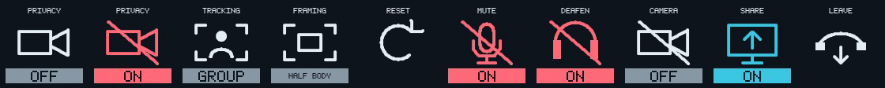
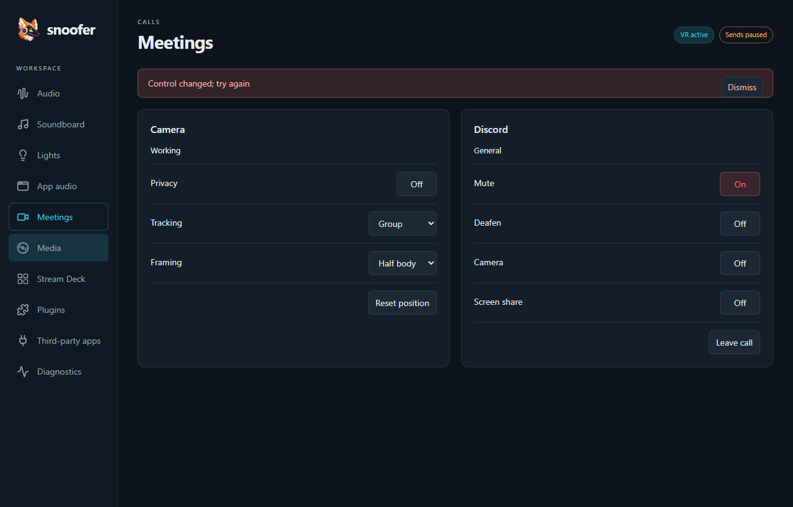

# UI contract

This is the baseline for every build, not a redesign prompt. Change it only when a requested UX change requires it. Preserve everything outside that change.

## Branding
Use the existing Snoofer mascot from app/tray.ico (source artwork in docs/assets). Do not invent a replacement logo or monogram for a new surface. Preserve the existing centered painterly mascot at the top of README.md when rewriting documentation.

## Goals and tone
Fast recognition, truthful state, predictable actions. Users know Snoofer. Use short nouns and state words, sentence case in source, no tutorial copy, enthusiasm, redundant qualifiers or implementation terminology. Keep consequential warnings (restart/recording interruption) and actionable error details.

## Content by surface
| Surface | Content |
| --- | --- |
| Deck key | Short label, recognizable icon, current state or local status. One or two words where possible; max 16 ASCII characters for built-ins. No explanatory sentences, action IDs or profile suffix on active-profile controls. |
| Deck dial | Target, large value, position track (gain over -60..+12 dB with a 0 dB mark, or a percentage), live meter; page dial shows previous/current/next page names on three lines, with the current name larger and cyan; neighboring names are smaller and neutral. Press still returns Home. No repeated gain label when dB is visible. |
| GUI | Task-oriented Audio, Routing, Soundboard, Lights, App audio, Meetings, Media, Stream Deck, Plugins, Third-party apps and Diagnostics screens. Plugins only enables, disables and retries; no settings or plugin controls appear there. Native controls, keyboard focus, spatial deck editor and persistent local feedback. |
| Tray | Open controls, lifecycle actions, concise state. No tutorials. |

Provider Label identifies an action without an icon. Optional ShortLabel is for compact icon-bearing surfaces. Shortening presentation must never change IDs, layout bindings, command semantics or saved settings. Fixed-profile bindings retain Normal/VR qualifiers. Custom plugin labels remain intact.

## Vocabulary
| Meaning | Deck label/state |
| --- | --- |
| Mic mute / speaker mute | Mute (different mic/speaker icons) |
| Monitoring | Monitor; Off / Pre / Post |
| Processing | Mic processing; Direct / Element |
| Stack enablement | Mic stack; On / Off |
| Mic stack Off on the deck | Mic mute, Mic target, Processing, Monitor, Mic gain, Record mic and Mic stage keys/dials are blank and inert (bindings kept); Mic stack stays visible. The GUI keeps showing them. |
| Input selection | Mic target; Auto / selected device |
| Recording capture | Record mic / Record PC; On / Off |
| Recording tap | Mic stage; Pre / Post |
| Recorder transport | Record / Stop rec; Ready / Rec |
| Tape playback | Play (Ready / Playing with pause bars / Paused), Stop, Rew, FF; plays the recorder's loaded file to the Playback destination; N/A while recording, Stop only while playing |
| Media transport | Prev / Play / Next / Stop; no fictitious playback state |
| Soundboard | Filename / Stop; Ready / Playing (cyan), Wait during normalization; failures stay local to the clip |
| Gain | Playback / Mic; numeric dB, position track and meter; while Element is the effective processing, the Mic meter shows the processed return (AUX) |
| Soundboard gain | Volume; numeric dB; press resets to 0 dB |
| Soundboard overlap | Overlap; On / Off (stacked play symbol). On: up to 8 clips play together, the oldest is cut; Stop silences all |
| Hue scene | Scene name; Ready / Active (cyan); Wait until the bridge confirms |
| Hue room dial | Brightness: percent or Off, press toggles on/off; no color-temperature control |
| Hue pairing | Pair; Ready / Press button / Paired |
| Hue Sync | Sync; On (cyan) / Off. Sync bright: percent, press toggles sync. Mode / Intensity: app value |
| Pending | Wait |
| Unavailable or unknown | N/A; meter LEVEL N/A |
| Failed | Error; detailed diagnostic in GUI |
| Overridden normal profile | VR; GUI VR override |

Status takes priority only on the affected control. Keep uncertainty distinct from Off or zero. Meter expiry must not show silence. Ready is not recording; enabled capture is not recorder transport.

## Color semantics
Colors supplement shape and words; they never carry state alone. Key backgrounds stay dark; no perimeter borders. Icon and state badge follow the same local semantic accent.
| Meaning | Deck color | Use |
| --- | --- | --- |
| Normal text | #E3EDF3 | Labels and neutral symbols |
| Neutral | #8797A3 | Off, Ready, generic commands |
| Active | #3AC6E1 | On/live, active processing mode, enabled monitor |
| Attention | #EEB74C | Wait, fallback, confirmation |
| Critical / audio inhibition | #FF6978 | Error, muted mic/output, recorder currently recording |
| Unavailable | #8797A3 | N/A; never danger merely because a device is absent |
| Background | #0E141B | Key and dial background |
| Meter signal | #2DD28C / #F5BE3C / #FF5A64 | -60..0 dBFS continuous gradient over a dimmed unlit track; amber from the -12 dB region, red near -3 dB; held peak tick (red at -3 dB or above); not application status |

Precedence: unavailable > failure > pending/fallback > muted/recording > active > neutral. Ordinary Off is neutral, including disabled mic stack. Recording's circle/square and Ready/Rec distinguish transport state. No arbitrary colors per control/category. Color definitions and precedence live in internal/streamdeck/palette.go.

The GUI replaces the terminal renderer. Use the available workspace responsively: a vertical sidebar (Up/Down), content cards, and a spatial deck grid with a contextual inspector. Tab follows standard focus order; arrows on the deck follow its geometry. Never dispatch a binding merely by selecting its position. Keep text edits, search and focus stable during live updates. Surface-only audio transport actions stay off the Audio page; they remain available as deck bindings. The exception is the Recording card's recorder row: Record, Play/Pause, Stop, Rewind and Fast-forward (the last two as icon buttons).

GUI icons are Lucide line icons (vendored; nav, buttons, placeholders, deck previews), never Unicode glyphs; Stream Deck hardware keys keep their code-drawn icons. GUI styling is Tailwind utilities with palette tokens in app/web/tailwind.css; no hand-written component classes. The sidebar has no host-connection footer; a lost host connection appears as the error notice. The shared header shows only transient badges (Sending, VR active, and Devices paused / Sends paused while Disable device or send manipulation is on); audio health appears as the Engine row on the Audio screen and on Diagnostics, never in the header. Apply the shared state palette to the GUI, with a separate visible focus outline. Normal sections are subdued but editable during VR override. Keep important errors local and visible; Diagnostics holds full details. Explicit Save/Discard applies only to draft deck configuration; regular audio controls remain live. Use the existing logo, not a new mark. Minimum window is 800×600; do not cap the workspace to terminal dimensions.

## Visual and behavioral invariants
- Studio line icons, dark background, label above symbol, state badge below; no key outline.
- Signal path is left-to-right. Direct bypasses FX; Element passes through FX. Pre/Post taps branch before/after FX.
- Mic stack is power, mute is a mic with a slash when muted.
- Keep native rotation, blank unused keys, user-owned pages, dial pagination and meter placement.
- Do not change bindings, page positions, shortcuts, profile ownership, save/apply behavior or confirmations as a side effect of copy/style work.
- A UI change must update this contract when needed, add/update focused presentation checks, and inspect actual native-size renderer output. No fresh visual direction or synonyms on routine builds.

## Visual baseline

Top: normal labels and signal-path states. Bottom: stack Off, muted, recorder Ready/Rec, Wait, Error, N/A, and fallback. The last example shows the amber fallback accent and * suffix. A supplied fallback never relies on color alone.

## Deck pages
Pages are organized by task: Home holds live essentials; content pages (Soundboard, Lights) hold browsing. Fixed controls sit on an edge row or column; generated content fills regions; overflow sets repeat the fixed frame, and Up/Down scroll keys page through them. A control keeps its position across the pages it appears on (Playback and Mic are dials 1–2, Brightness is dial 5). Home reaches each content page in one press with go-to keys; the page dial's press returns Home, so there is no Home key. Blank means not applicable now; N/A means expected but unknown.

App audio (the `appaudio` plugin) gives each app a dial and a mirroring key on the Apps page: turn for volume, press to mute. Keys show the app icon, name and `42%`, `Muted` (critical) or `Mixed`, and Pending until Windows reports the change; `Ignored by app` marks programs that reset their own volume. Picked apps come first, then apps heard within a configurable window (5 minutes by default, set on the App audio screen). The App audio screen offers a strip per app with pin, order, Rename, Combine into… and Hide; an Excluded card of program file names (wildcards allowed; Snoofer, Voicemeeter, audiodg and Hue Sync by default) with Add and Remove, showing which running apps each hides; and per-app details (executables, PIDs, devices, rule). Dial regions fill dials from a collection and page in step with key regions.

Apps and sessions without a logo show a placeholder tile in a colour derived from their name (the same colour every time), with a window or play glyph. Now playing lists every media session: Windows players, and each browser tab while the Snoofer extension is connected, which replaces that browser's single Windows entry. Session keys show cover art and Playing/Paused; a press plays or pauses that session and focuses it. Focus is sticky: a chosen session or app keeps its dial until Reset focus; otherwise the media dial follows the latest playback and the focused-app dial the first app. On session and app keys a tap plays/pauses or mutes and a hold chooses focus. There is no Focus key. Transport keys sit on the Media page's bottom row. Apps share the Media page: the Media page's dials are Playback, media, the focused app, then apps (never the same app twice), Home's row 1 is the mic path ending with Echo and Echo strength; row 2 is recording, left to right: Record mic, Record PC, Mic stage, Record, Play, Stop, Rew, FF. Home's bottom row is Previous, Play/Pause, Next, Brightness, Motion and the go-to keys, with session and app strips on row 3 (clipped: no extra Home pages; tap plays/pauses or mutes, hold chooses focus) and Reset focus at r3c9, which returns both focus dials to their defaults; Home's dial 4 is the focused-app dial; Home's transport keys act on the focused session, with an Apps filter (All, Pinned, Off) and a Media filter (On, Off) on the bottom row; filters affect the deck only. Sessions and apps share rows 1–3 by need, so a filtered category's space goes to the other, and a hidden binding's key or dial is reused by a covering region. The media dial shows art, title and `m:ss / m:ss` with a progress track; turning seeks 5 s per detent, and a press plays or pauses. Previous, Play/Pause, Next and Mute (tabs only) act on the focused session and are blank when it cannot do that. The Media screen shows session cards and a Browser extension card with connection status and install steps; the Snoofer Media extension needs no setup or pairing.

Echo cancellation (the `aec` plugin) removes speaker echo from the managed microphone. Its mode is Auto (active while playback goes to speakers), On or Off, and Strength is Strong, Balanced or Gentle. Status is Active with echo removed (dB) and the estimated delay, Idle with the reason (Headphones, Mic off, Needs 48 kHz and similar), Wait, Off or Error (the mic passes through). The Audio screen has an Echo cancellation card, and the Echo key (speaker, struck-out sound, mic) cycles Auto, On and Off; On is cyan.

Regions are rectangles filled from a named collection (Soundboard clips, Scenes · selected room, Scenes · <room>) in label order, skipping Hidden members. Manual and shared bindings win, and overflow adds `Name N` pages. A legacy `auto_controls` prefix acts as a whole-page region. Go-to keys use the folder symbol with the page name and show Here on that page. Scroll keys (Up, Down) use arrow symbols, show the set position (`1/2`), wrap, and are blank when the page has one set; a page that binds one is a single stop on the page dial. The editor numbers keys from 1 everywhere, selects rectangles with Shift+click or Shift+arrows, and tints region cells. Selecting never dispatches.

## Soundboard pages
Clips fill a region; manual and shared bindings win. File names are labels; Play/Stop symbols identify transport. Matching PNG/JPEG/WebP/GIF artwork fits proportionally within a square and may replace the clip symbol in a 64px area, preserving its filename and state badge. Artwork colors are user content; badges retain semantic colors. Animated GIF artwork plays on keys and on the Soundboard screen; its first frame is the static artwork elsewhere, and GIFs over 120 frames stay static with a note. Invalid/missing artwork falls back to Play. Overlap, Up, Down and Stop hold column 9 on every generated set. While clips play, the touch-strip panels above unbound dials on pages with soundboard controls show each clip's artwork (or Play) and remaining time as `m:ss`, oldest first: one per panel, two per panel when more play. The configurator edits the saved template and previews automatic bindings; removing the region disables automatic filling.

Soundboard key reference (Ready, Playing, Stop, and sample artwork in Ready/Playing):

Page dial reference:

## Hue
Scene keys show generated artwork: a disc of wedges in the scene's dominant colors (sized by light count; dim scenes drawn darker), on keys and Lights cards. It replaces only the central symbol; scenes without color data keep the bulb symbol. Artwork colors are scene content, while badges keep semantic colors. Scene keys work with `auto_controls` prefixes (`hue.scene-` or `hue.scene-<room>-`). Brightness is a dial control without a meter: the strip shows target and value only, and while a write is pending it shows the requested value (GUI marks it pending) rather than Wait. A control's Icon is an identifier and never appears as dial text; only the page dial uses that field for page names. Hue Sync uses the screen-with-rays symbol; mode and intensity show the app's value. While syncing, Brightness shows `Sync 62%` and adjusts the sync stream. Room scene slots (`hue.room-scene-1`…`12`) mirror the selected room's scenes by name; an unused slot (unavailable, no label or icon) is a blank key, never N/A. A Hidden control is also a blank key with its binding kept: Mode and Intensity while not syncing, and Sync while the Hue Sync app is not connected. Motion toggles the selected room's motion sensors (the bridge's per-sensor enable): On, Off or Mixed, Pending until the bridge reports the change; it is blank when the room has no sensors. Snoofer controls only the rooms chosen on the Lights screen, in the GUI and on the deck. The Room key cycles the chosen rooms by name and is blank while only one is chosen; scene regions and Motion follow it. Selection keys always show option labels, never raw values.

Lights screen: setup banner only while something needs doing (Enable, Pair with the found bridge, link-button instruction, errors). Room card with the room picker in its header, a Brightness (On/Off) readout with slider and −/+, a Motion sensors row (only while the room has sensors), the room's scene cards and Other rooms (chosen rooms only). A Rooms card lists every room and zone with a checkbox; the last chosen one cannot be unchecked. Hue Sync card with Start/Stop sync, segmented Mode and Intensity (disabled with a reason while not syncing) and the Third-party control instruction when unreachable.

## Meetings
Camera card (Insta360 Link 2): the tracking state (Idle, Detecting, Working, Lost or Privacy) under the title, then Privacy, Tracking (Off / Single / Group), Framing (Head / Half body / Full body) and Reset position. Privacy disables the others with the reason Privacy. Discord card: the voice channel (or Not in a call) under the title, the setup hint while credentials are missing, Connect while Discord needs approval, then Mute, Deafen, Camera, Screen share and Leave call; Camera, Screen share and Leave need a call. Discord mute is the Mic mute preference, so its key reuses the mic symbol and mirrors Mic mute in automatic layouts. The Meetings deck page puts the call on row 1, with Leave alone at c9, and the camera on row 2; Home reaches it in one press. Deck symbols: a video camera for Privacy (slashed and red while private, like a mute) and Discord camera (slashed and neutral while off), frame corners around a person for Tracking and around a smaller frame for Framing, a return arrow for Reset, headphones for Deafen (slashed and red while deafened), a screen with a rising arrow for Share, and a hung-up handset for Leave. Selection keys show option labels.

## Third-party apps
One card per connection report, grouped by plugin: app name, state badge, endpoint (monospace), "Since" and "Last activity" as relative times (amber "stale" when activity is older than three report intervals), the last error with its age (critical while it is the current state; muted "Last error:" after recovery), details and Copy details. A summary shows OK / Attention / Problems / Idle counts and Copy all. Tone: connected and ready are active; connecting and attention are attention; error, and disconnected when the peer is required, are critical; disconnected optional peers and off, unconfigured and unknown stay neutral. Plugins that are not running are listed as Not monitored. Reports are read-only and never appear on the deck. Copied text uses absolute ISO timestamps and never contains credentials.

## Personal layout
Positions are row/column (r1c1 top-left). Home: Open controls at r4c5; Sync, Mode, Intensity and Brightness (press toggles the room) at r1c6–c9; Motion at r2c9; go-to Meetings, Soundboard and Lights at r4c6, r4c8 and r4c9. Lights: Room, Brightness, Motion, Sync, Mode, Intensity at r1c1–c6, room scenes region r2–r4. Soundboard: clips region r1–r4 c1–c8, Overlap r1c9, Stop r4c9. Meetings: Mute, Deafen, Camera and Share at r1c1–c4, Leave at r1c9; Privacy, Tracking, Framing and Reset at r2c1–c4. Chosen rooms: Cody Office. Dials: Playback (1), Mic (2), Brightness (5) on Home and Lights; Playback and Mic on Meetings; 3 and 4 unassigned; dial 6 is pagination. Soundboard dial 1 is Volume. This is a user-owned layout choice; do not relocate it during builds or overwrite other users' layouts.

## Routing
The Routing screen (after Audio) starts with Outputs: a matrix of sources (Computer, Monitor, Soundboard, Tape) against destinations (Playback, then up to three named output slots). Each cell is an On/Off switch (Monitor on Playback cycles Off/Pre/Post); Playback always receives tape listen-back. Column headers show the device and, for slots, In use (active), Missing (neutral) or No output (attention), with device choice, Rename and Remove. Add output takes a name and a connected device that is neither Playback nor another slot. Below it the screen edits device priorities: Interfaces (driver and presence patterns, Desk/Lav channels; 0 = none), Playback, Webcam and Mic priority. Rows are numbered in priority order with Up, Down and Remove; the last entry of a required list cannot be removed. Each entry shows its match under the planner's rules: In use (active), Ready, No match (neutral) or Ambiguous · N (attention), with matched names below. Suggestions list connected devices no entry matches, with Exact and Device additions; patterns are generated by Snoofer, never by the GUI. Add interface pairs an installed driver with the input that proves its hardware is present. Patterns apply on Enter or Apply, never while typing. Edits are saved before they apply and take effect without a restart; a refused edit shows its error above the lists and leaves routing unchanged. The sidebar scrolls when its items exceed the window height.

## Playback and interface
Interface is the global ASIO clock/input/output selection. Playback is the active listening destination; A1/A2 belong only in diagnostics. Use one Playback dial/mixer with destination name in the GUI. Home dials start with Playback at index 0 and Mic at index 1. Dials 1–5 are assignable; only dial 6 is reserved for pagination. Gain changes only on explicit adjustment; routing never copies or resets gains. Playback mute is Snoofer-owned persisted desired state; native disagreement is pending, never a replacement preference.

Meters on dials and GUI strips share ballistics: instant attack, 24 dB/s release, 1.5 s peak hold then an 18 dB/s fall. Ballistics shape presentation only; an unknown or expired reading resets them and shows LEVEL N/A. The deck refreshes every 60 ms while a shown dial has a meter; the GUI polls every 100 ms on Audio and Soundboard.

The Echo cancellation card includes an Engine selector: WebRTC AEC3 (default), LocalVQE echo-only, and LocalVQE voice cleanup. Strength is disabled for neural engines. Neural processing is 16 kHz mono with reported processing latency (about 93 ms with 512 samples at 48 kHz); active status states this limit. Neural reference is an eight-channel downmix, so independent surround cancellation is not equivalent to AEC3. Loading shows Wait; a load/deadline failure shows Error with microphone pass-through. Engine choice is saved before switching. Deck layout and Auto/On/Off remain unchanged.

LocalVQE full-band is an optional fourth engine: the voice-cleanup neural model below a 6 kHz crossover and WebRTC AEC3 above it. It requires a 48 kHz host stream, with other rates showing Needs 48 kHz and pass-through. Status reads 48 kHz mono · hybrid plus measured processing latency (approximately 95 ms at 512 samples). Existing neural modes and preferences stay unchanged; the upper band has echo control but does not receive the neural noise cleanup.

Echo cancellation has a Retry button, enabled for engine or load failures while processing is wanted, disabled during loading, inactivity or unconfirmed hook removal. Retry resets only AEC and does not change saved preferences. Latched native failures retry automatically every 15 seconds; the error remains visible with automatic retry pending, and a reset shows Wait until processing is observed.
