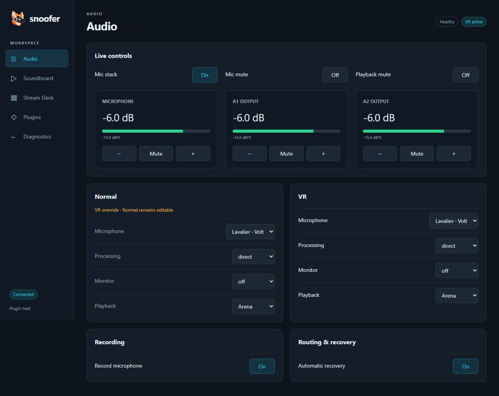
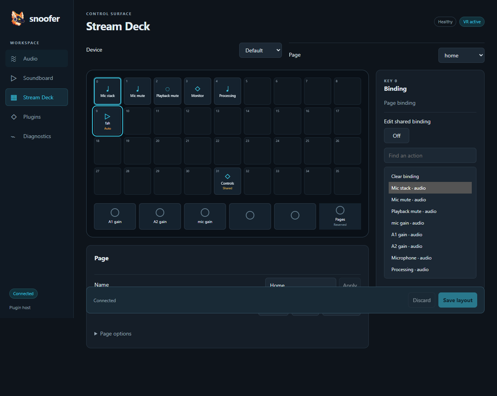

# Desktop controls validation — 2026-10-05

## Delivered
Wails/WebView2 GUI replaces Bubble Tea. The existing mascot is served from the same embedded ICO as the tray and applied to the native window using the existing executable resource. Audio, Soundboard, Stream Deck, Plugins and Diagnostics retain the tray host's revision-checked actions and provider-owned settings. Terminal renderer and console-only helpers are removed.

## Automated evidence
- scripts/check.ps1 -GUI completed successfully: all Go tests, vet, GUI model tests, all 39 OpenSpec validations, callback ABI checks, native companion builds and canonical bin/snoofer.exe.
- Browser workflows passed on installed Chrome at 1280x820 and 800x600: sidebar navigation; spatial keyboard focus without action dispatch; deck position selection; unsubmitted text surviving snapshots; explicit text Apply; save dispatch; visible stale-action errors; clip filtering surviving updates; plugin selection and confirmation cancellation; no horizontal overflow or JavaScript exceptions.
- Inspected browser screenshots for Audio and Stream Deck after restoring the real logo; fixture screenshots are saved below. They are rendering evidence, not live mixer measurements.
- Native packaged WebView2 smoke passed through Windows UI Automation: accessible navigation and toggle; incoming fixture state; exact outbound control ID/revision; window close and reopen; host EOF closes the child with exit code 0. It starts no plugins and does not mutate personal settings.
- Opaque presentation snapshots are clone-isolated; deck preview ownership and action-queue bounds are covered by Go tests.
- Development dependencies are pinned in package-lock.json. npm ci --ignore-scripts restored 72 packages successfully; GUI checks no longer require a Codex-specific dependency path.

## Deployment and limits
Rebuilt only bin/snoofer.exe through scripts/build.ps1 and restarted the normal configuration. Verified live controls expose real audio values and profile/routing sections via Windows accessibility, without invoking live audio actions. Closing the controls child leaves plugin ownership in the existing host.

Race testing remains unavailable with the current disabled CGO toolchain. Audible output, physical deck acceptance and user visual preference remain manual checks. The deck grid uses semantic symbols/artwork; it is not a pixel-identical emulator of the hardware's JPEG renderer.

