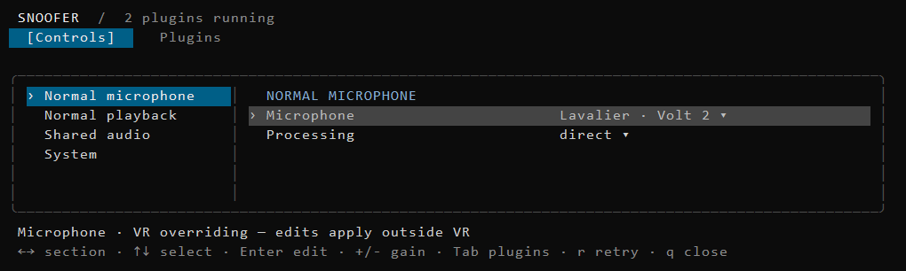

# Validation — 2026-10-05

- Commit 848c45c implements section navigation and compact forms. Regression checks cover action targeting, snapshot reordering, removed/empty groups, wraparound, long section lists, diagnostics, NO_COLOR, editing and terminal bounds.
- scripts/check.ps1 passed: all Go tests, vet, 38 strict OpenSpec validations, native callback ABI checks, companion DLL builds and canonical bin/snoofer.exe.
- Opt-in TestControlsConsoleProcess passed for attached/detached console allocation and preserved IPC; TestCoreDesktopSmoke passed isolated dry-run tray lifecycle.
- Inspected actual View ANSI output as text and as a color-aware raster preview at 100x30. Preview uses the test fixture and a terminal-like font renderer, not a screenshot of the live console.
- Restarted the canonical app (PID 36632) with automation-only NO_COLOR removed. User and machine NO_COLOR were absent; explicit application NO_COLOR support remains tested.
- Race testing remains unavailable with the existing disabled CGO toolchain. Physical live-window acceptance is unperformed.

